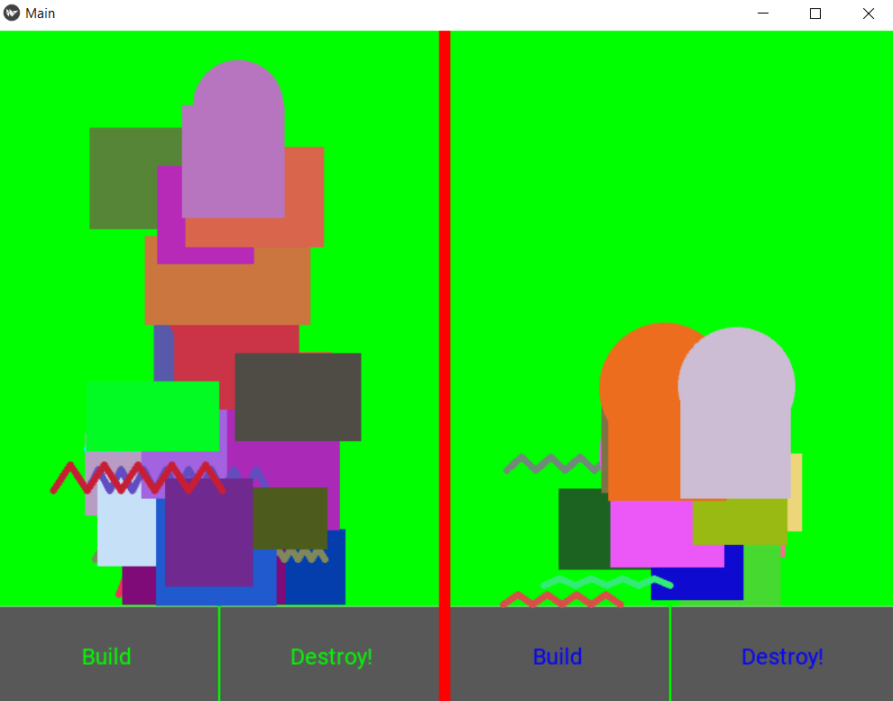

# Kivy-towers
Game made with python3 and kivy

I experience severe problems with the memory. 
Whenever the amount of drawn objects reaches around 50, the screen freezes and the game ends printing: 
MemoryError
Exception ignored in: 'kivy.graphics.instructions.Instruction.radd'
Can anyone help me to solve this problem?

### install

you need Python3 and kivy  installed 
  * http://python.org
  * http://kivy.org 
  
  
  
